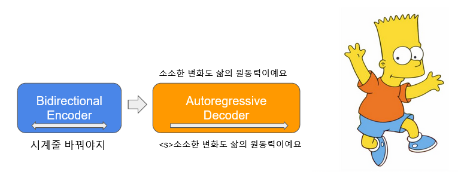

<!-- @import "[TOC]" {cmd="toc" depthFrom=1 depthTo=6 orderedList=false} -->

<!-- code_chunk_output -->

- [Simple Chit-Chat based on KoBART](#simple-chit-chat-based-on-kobart)
  - [Purpose](#purpose)
  - [Architecture](#architecture)
  - [Install](#install)
  - [How to Train](#how-to-train)
  - [Chat!](#chat)
  - [Colab tutorials](#colab-tutorials)

<!-- /code_chunk_output -->


# Simple Chit-Chat based on KoBART 


## Purpose

- [공개된 한글 챗봇 데이터](https://github.com/songys/Chatbot_data)와 pre-trained [KoBART](https://github.com/SKT-AI/KoBART)를 이용한 간단한 챗봇 실험
- `KoBART`의 다양한 활용 가능성을 타진하고 성능을 정성적으로 평가한다.

## Architecture



## Install

```python
# KoBART 설치 
pip install git+https://github.com/SKT-AI/KoBART#egg=kobart
pip install pytorch_lightning
git clone --recurse-submodules https://github.com/haven-jeon/KoBART-chatbot.git
```

## How to Train

1. `KoBART` 모델 다운로드

```python
>>> from kobart import get_pytorch_kobart_model, get_kobart_tokenizer
>>> get_kobart_tokenizer(".")
>>> get_pytorch_kobart_model(cachedir=".")
```

2. chit-chat fine-tuning

```sh
$ python kobart_chit_chat.py  --gradient_clip_val 1.0 --max_epochs 3 --default_root_dir logs --model_path kobart_from_pretrained  --tokenizer_path emji_tokenizer --chat --gpus 1
```

## Chat!

```
user > 나 정말 ㅜㅜ.  
Simsimi >  무슨 일 있었나봐요.
user > 나 정말 🤣
Simsimi >  그런 사람는 거르세요.
user > 나 정말 ^^
Simsimi >  칭찬이네요.
user > 너무 어두워.
Simsimi >  빛이 있을 거예요.
user > 어버이날엔 뭘 하죠?
Simsimi >  어버이날은 가족들과 함께 보내는 시간이니 만큼 가족들과 함께 하는 시간이 좋을 거예요.
user > 큰돈을 만드는 방법은?
Simsimi >  돈은 쓴만큼 또 생긴다고 하던데요.
user > 집은 너무 비싼거 같아요.
Simsimi >  돈을 얼른 모아야할 이유가 생겼네요.
```

## Colab tutorials

- [](https://colab.research.google.com/github/haven-jeon/KoBART-chatbot/blob/master/KoBART_chitchat.ipynb)
